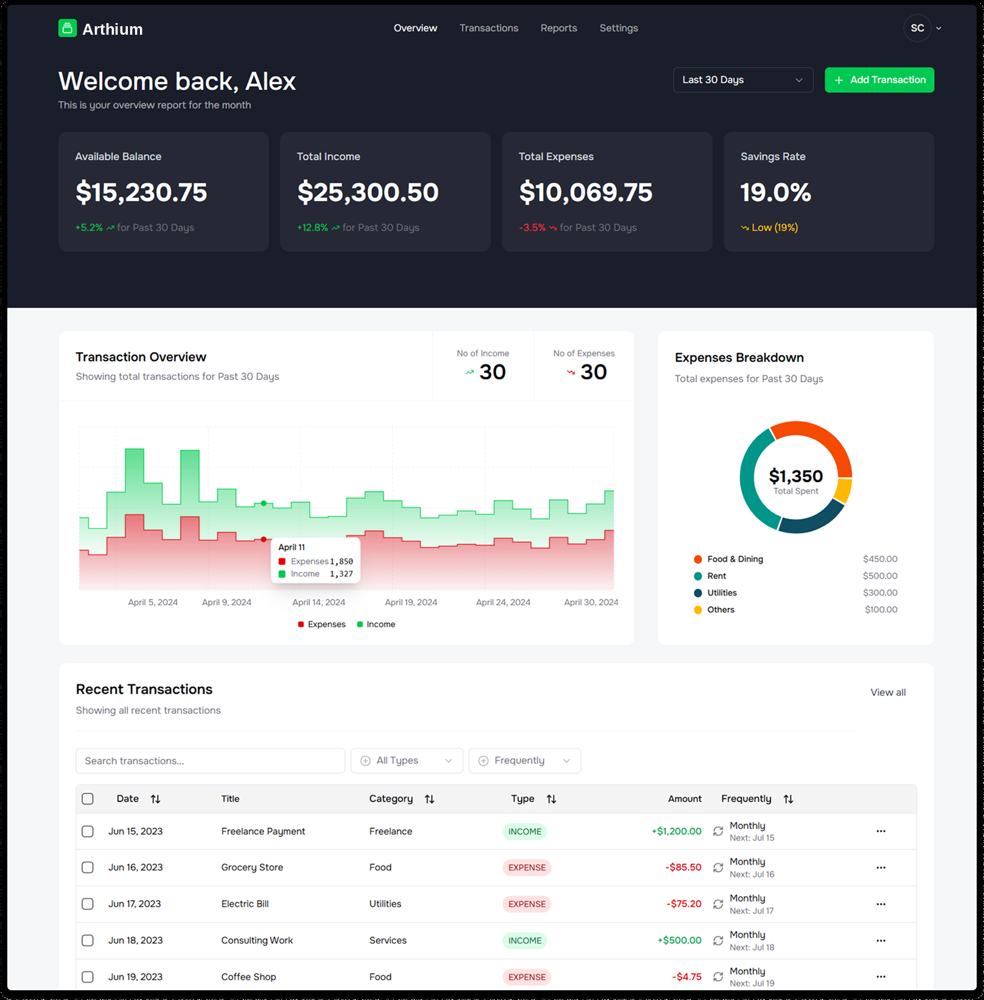

# 💰 Arthium — AI-Powered Finance Platform (Client)

An **intelligent finance management platform** that helps users track, analyze, and automate their personal or business transactions.
Users can add transactions **manually**, **import them in bulk** from CSV, or **scan receipts**, which are automatically analyzed with **Gemini AI** to extract key details such as date, amount, merchant, and category.

This repository contains the **frontend client** — a React + TypeScript single-page app built with Vite. It talks to a separate FastAPI backend over a REST API (`VITE_API_URL`); the backend service is not part of this repo.



---

## 🚀 Features

### 🧠 AI Receipt Scanning
- Upload a receipt image/PDF and have transaction fields (date, amount, merchant, category) extracted automatically via **Gemini AI**.
- Manual transaction entry, CSV bulk import, duplication, editing, and bulk delete are also supported.

### 📊 Financial Insights & Visualization
- Analytics dashboard summarizing income, expenses, income-to-expense ratio, and monthly spending trends.
- Interactive charts and a sortable/filterable transactions table (built on TanStack Table).

### 🔁 Automation & Scheduled Reports
- Users can enable/disable automatic report generation on a schedule from **Settings → Report Schedule**.
- Reports are generated server-side and listed/paginated in the client.

### 💬 AI Chat Interface
- Ask questions about your finances in natural language and get grounded, context-aware answers.
- Powered by **Gemini AI**, with responses rendered dynamically as text, bullet lists, tables, or charts (line/bar/pie/donut) depending on the query.

### 🔐 Authentication & Session Handling
- JWT-based login/register/forgot-password (OTP) flows.
- Access tokens are refreshed transparently: a custom RTK Query `baseQuery` retries a request once after refreshing the token on a `401`, then logs the user out if the refresh also fails.
- Redux state (including auth) is persisted via `redux-persist`, encrypted at rest with `redux-persist-transform-encrypt`.
- Route guards (`AuthRoute` / `ProtectedRoute`) keep authenticated and unauthenticated flows separate.

### ⚙️ Settings
- Account details, appearance/theme (light/dark via `next-themes`), billing plan, and scheduled report preferences.

### ☁️ Cloud & CI Integration
- Receipts are uploaded to **Cloudinary** by the backend.
- **CI/CD** via GitHub Actions: lint, typecheck, test with 100%-threshold coverage, and a production build run on every push/PR to `main`.

---

## 🛠️ Tech Stack

- **Framework:** React 19, TypeScript, Vite 6
- **Routing:** React Router v7
- **State/Data:** Redux Toolkit + RTK Query, redux-persist (encrypted)
- **UI:** Tailwind CSS v4, Radix UI primitives, shadcn/ui (`new-york` style), lucide-react icons
- **Forms/Validation:** react-hook-form + zod
- **Charts/Tables:** Recharts, TanStack Table
- **Testing:** Vitest, React Testing Library, MSW (mocked API layer), jsdom, 100% coverage thresholds (statements/branches/functions/lines)
- **Tooling:** ESLint + typescript-eslint

---

## 📂 Project Structure

```
src/
├── app/            # Redux store, RTK Query api-client (auth refresh, tags)
├── components/     # Shared UI (data-table, sidebar, navbar, transaction, ui/ shadcn primitives, ...)
├── constant/       # App-wide constants
├── context/        # Theme provider
├── features/       # RTK Query slices per domain: auth, transaction, analytics, report, user
├── hooks/          # Reusable hooks (debounce search, auth expiration, mobile detection, ...)
├── layouts/        # App shell vs. base (auth) layout
├── lib/            # Formatting/util helpers
├── pages/          # Route-level screens: dashboard, transactions, reports, ai-chat, settings, auth
├── routes/         # Route definitions and guards (AuthRoute, ProtectedRoute)
└── test/           # Vitest setup, MSW server/mocks, test utilities
```

---

## 🚦 Getting Started

### Prerequisites
- Node.js 20+
- npm

> **Note:** `react-day-picker@8`'s peer range predates React 19. Install with `--legacy-peer-deps` until it (or an alternative) adds React 19 support.

### Setup

```bash
npm install --legacy-peer-deps
```

Create a `.env` file in the project root:

```bash
VITE_API_URL=<backend API base URL>
VITE_REDUX_PERSIST_SECRET_KEY=<any local secret used to encrypt persisted redux state>
```

### Scripts

| Command                | Description                                   |
| ----------------------- | ---------------------------------------------- |
| `npm run dev`           | Start the Vite dev server                      |
| `npm run build`         | Type-check (`tsc -b`) and build for production |
| `npm run preview`       | Preview the production build locally           |
| `npm run lint`          | Run ESLint                                     |
| `npm run typecheck`     | Type-check without emitting                    |
| `npm test`              | Run the Vitest suite once                      |
| `npm run test:watch`    | Run Vitest in watch mode                        |
| `npm run test:coverage` | Run tests with coverage (100% thresholds)      |

---

## ✅ Continuous Integration

Every push/PR to `main` runs four jobs in GitHub Actions (`.github/workflows/ci.yml`): **Lint → Typecheck → Test + coverage → Build** (build depends on the first three passing). The coverage report is uploaded as a build artifact on each run.
